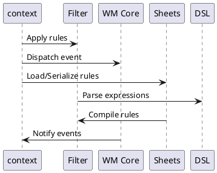

# Architecture Overview

## High-Level Component Diagram

```mermaid
graph LR
    Context -->|manages| Filter
    Context -->|interacts| Sheets
    Context -->|controls| "WM Core"
    Filter -->|parses| DSL
    Sheets -->|serialize| Rules
    "WM Core" -->|handles| Events
```

## Components

- **Context**: Serves as the core of the application, managing connections to the X11 server and tracking the state of windows. It acts as the mediator between different components.

- **Filter**: Implements the DSL for filtering windows. It processes rules and applies them to determine which windows to monitor or ignore.

- **Sheets**: Responsible for rule serialization and compilation to various formats (`.rule`, `.json`, `.bin`).

- **WM Core**: Directly interacts with the X11 server, handling window events (create, destroy, configure, map/unmap, property changes).

## Event Flow

1. **Event Reception**: Events are received from the X11 server.
2. **Context Dispatch**: The `Context` component dispatches these events to relevant subcomponents.
3. **Filtering**: Events related to windows are filtered according to the set rules using the `Filter` component.
4. **Rule Application**: Filtered events are processed further, potentially altering the window state or triggering actions.
5. **Serialization**: Rules can be saved and loaded using the `Sheets` component, allowing persistent configurations.

## Thread Model

- **Main Thread**: Responsible for starting the application and initializing components. It also handles command-line interface interactions.

- **Event Loop**: Listens for X11 events and dispatches them asynchronously to avoid blocking the main thread.

- **Worker Threads**: Used for rule processing, allowing parallel evaluation of window filters, ensuring responsive real-time monitoring.

- **Synchronization**: Mutexes and channels are utilized to synchronize access to shared data among threads, maintaining consistency across window states and filters.

## Diagrams

### Component Interaction



